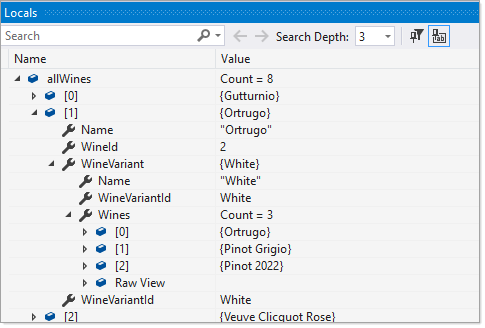
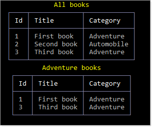
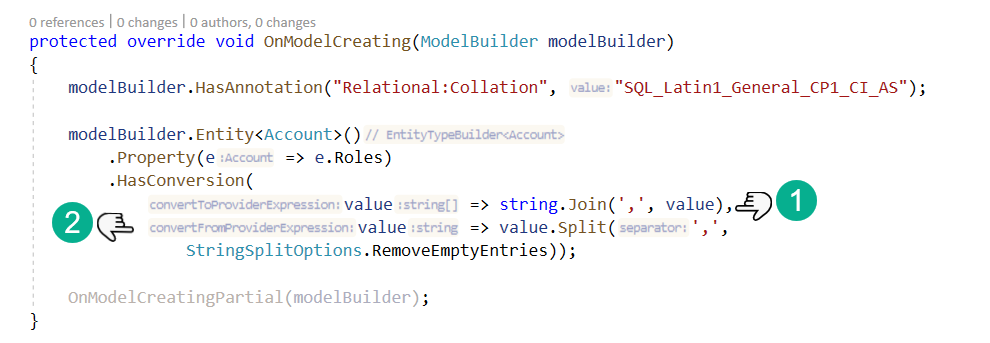
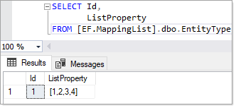
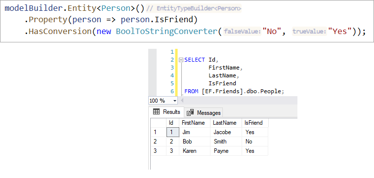

# EF Core Value Conversions

## Introduction

EF Core provides methods to transform one type into another. Most common use is with enumerations while many other transformations are possible. In this article/code sample there are two samples for enumerations and one for string array.

[Bulk-configuring a value converter](https://docs.microsoft.com/en-us/ef/core/modeling/value-conversions?tabs=data-annotations#bulk-configuring-a-value-converter) is possible as shown below.

[Pre-defined conversions](https://docs.microsoft.com/en-us/ef/core/modeling/value-conversions?tabs=data-annotations#pre-defined-conversions)
EF Core contains many pre-defined conversions that avoid the need to write conversion functions manually. Instead, EF Core will pick the conversion to use based on the property type in the model and the requested database provider type.

The code samples below allow a developer to get started by following along with provided code.

Code by itself is not enough, take time to read [Microsoft documentation](https://docs.microsoft.com/en-us/ef/core/modeling/value-conversions?tabs=data-annotations).

Check the following [page](https://docs.microsoft.com/en-us/dotnet/api/microsoft.entityframeworkcore.storage.valueconversion?view=efcore-5.0) for builtin converters.

:small_orange_diamond: Although there are many articles out there on transformations, this has ready to run examples.

:small_orange_diamond: Although I coded this repository


```csharp
public class CurrencyConverter : ValueConverter<Currency, decimal>
{
    public CurrencyConverter()
        : base(
            v => v.Amount,
            v => new Currency(v))
    {
    }
}
```

# Enumerations

In this example we want to categorize wines. The model has a primary key, string which represents the wine name and a enum for category,


```csharp
public class Wine
{
    public int WineId { get; set; }
    public string Name { get; set; }
    public WineVariantId WineVariantId { get; set; }
    public WineVariant WineVariant { get; set; }
    public override string ToString() => Name;
}
```

**Enum**

```csharp
public enum WineVariantId : int
{
    Red = 0,
    White = 1,
    Rose = 2
}
```

The following provides a `one to many relationship`

```csharp
public class WineVariant
{
    public WineVariantId WineVariantId { get; set; }
    public string Name { get; set; }
    public List<Wine> Wines { get; set; }
    public override string ToString() => Name;
}
```

Using `HasConversion` in the `DbContext`

```csharp
protected override void OnModelCreating(ModelBuilder modelBuilder)
{
    modelBuilder
        .Entity<Wine>()
        .Property(e => e.WineVariantId)
        .HasConversion<int>();

    modelBuilder
        .Entity<WineVariant>()
        .Property(e => e.WineVariantId)
        .HasConversion<int>();

    modelBuilder
        .Entity<WineVariant>().HasData(
            Enum.GetValues(typeof(WineVariantId))
                .Cast<WineVariantId>()
                .Select(e => new WineVariant()
                {
                    WineVariantId = e,
                    Name = e.ToString()
                })
        );
}
```

**Let's query for all wines**

```csharp
using System.Linq;
using HasConversion.Data;
using HasConversion.Models;
using Microsoft.EntityFrameworkCore;
using Spectre.Console;
using static HasConversion.Models.WineVariantId;

namespace HasConversion.Classes
{
    public class WineOperations
    {
        /// <summary>
        /// If database does not exists than pass true to this method
        /// to create and populate with several records.
        ///
        /// Otherwise passing false to view records in database
        /// </summary>
        /// <param name="reCreate"></param>
        public static void AddViewWines(bool reCreate = false)
        {
            using var context = new WineContext();
            var allWines = context.Wines.Include(item => item.WineVariant).ToList();
        }
    }
}
```

**Results**



**Display**


To be consistent let's do the same pattern with books and category for books.

```csharp
public partial class Book
{
    public int BookId { get; set; }
    public string Title { get; set; }
    public BookCategory BookCategory { get; set; }
    public override string ToString() => Title;
}

public class BookVariant
{
    [Key]
    public BookCategory BookCategoryId { get; set; }
    public string Name { get; set; }
    public List<Book> Books { get; set; }
    public override string ToString() => Name;
}
```

Setup the conversion, in this case we are not setting up for one to many but by following the pattern above we can.

```csharp
protected override void OnModelCreating(ModelBuilder modelBuilder)
{
    modelBuilder.HasAnnotation("Relational:Collation", "SQL_Latin1_General_CP1_CI_AS");


    modelBuilder
        .Entity<Book>()
        .Property(e => e.BookCategory)
        .HasConversion<int>();

    modelBuilder
        .Entity<BookVariant>().HasData(
            Enum.GetValues(typeof(BookCategory))
                .Cast<BookCategory>()
                .Select(e => new BookVariant()
                {
                    BookCategoryId = e,
                    Name = e.ToString()
                })
        );
}
```

**Get all books**

```csharp
var bookList = context.Book.ToList();
```

Get by specific category `Adventure`

```csharp
var list = bookList.Where(books => books.BookCategory == BookCategory.Adventure).ToList();
```




# Enum tip

When working with enum, consider placing the enum values in a database table and use a T4 template to generate the model. This will be helpful when there are many projects using the same enum and saves time if a member name changes, members are deleted or added.

:small_orange_diamond: There are several [examples included](https://github.com/karenpayneoregon/ef-core-transforming/tree/master/EntityFrameworkCoreHasConversion/Templates).


## String to array

This one although provides a decent sample for using HasConversion the data model can be improved. This comes from the following [forum question](https://docs.microsoft.com/en-us/answers/questions/866164/parse-json-data-for-insert-into-sql-table.html).

> I know I can create classes from the JSON data, and parse out the elements. Butttt how do I then insert into MS SQL Server tables?

Their code

```csharp
public class Account
 {
     public string Email { get; set; }
     public bool Active { get; set; }
     public DateTime CreatedDate { get; set; }
     public IList<string> Roles { get; set; }
 }
    
    
 string json = @"{
   'Email': 'james@example.com',
   'Active': true,
   'CreatedDate': '2013-01-20T00:00:00Z',
   'Roles': [
     'User',
     'Admin'
   ]
 }";
    
 Account account = JsonConvert.DeserializeObject<Account>(json);
    
 Console.WriteLine(account.Email);
```

One forum member recommended to string string concatenation which is okay but EF Core can handle this.

My recommendation

Model which changes the Roles property to a string array.

```csharp
public partial class Account
{
    public int Id { get; set; }
    public string UserName { get; set; }
    public string Email { get; set; }
    public bool? Active { get; set; }
    public DateTime? CreatedDate { get; set; }
    public string[] Roles { get; set; }
}
```

**Conversion**

```csharp
protected override void OnModelCreating(ModelBuilder modelBuilder)
{
    modelBuilder.HasAnnotation("Relational:Collation", "SQL_Latin1_General_CP1_CI_AS");

    modelBuilder.Entity<Account>()
        .Property(e => e.Roles)
        .HasConversion(
            value => string.Join(',', value),
            value => value.Split(',',
                StringSplitOptions.RemoveEmptyEntries));

    OnModelCreatingPartial(modelBuilder);
}
```



**View records**

```csharp
public static void ViewAccounts()
{
    using var context = new AccountContext();
    var accountList = context.Account.ToList();

    var table = CreateViewTable();

    foreach (var account in accountList)
    {

        if (account.Id.IsEven())
        {
            table.AddRow($"[bold yellow on green]{account.Id}[/]", $"[bold yellow on green]{account.UserName}[/]");
        }
        else
        {
            table.AddRow($"{account.Id}", account.UserName);
        }

        foreach (var role in account.Roles)
        {
            table.AddRow("", role.PadLeft(10));
        }

        table.AddEmptyRow();

    }

    AnsiConsole.Write(table);

    var admins = accountList.Where(account => account.Roles.Contains("Admin")).ToList();


}
```

## Storing List

In this case a List&lt;int>

**Model**

```csharp
public class EntityType
{
    public int Id { get; set; }
    public List<int> ListProperty { get; set; }
}
```

**Conversion**

```csharp
protected override void OnModelCreating(ModelBuilder modelBuilder)
{
    
    modelBuilder
        .Entity<EntityType>()
        .Property(e => e.ListProperty)
        .HasConversion(
            v => JsonSerializer.Serialize(v, null),
            v => JsonSerializer.Deserialize<List<int>>(v, null),
            new ValueComparer<List<int>>(
                (list1, list2) => list1.SequenceEqual(list2),
                c => c.Aggregate(0, (a, v) => HashCode.Combine(a, v.GetHashCode())),
                c => c.ToList()));
    
}
```

**Add record**

```csharp
var entity = new EntityType { ListProperty = new List<int> { 1, 2, 3 } };
context.Add(entity);
context.SaveChanges();
```

**Result**




## BoolToStringConverter

This converter transforms a bool to string where the value in the database table will be a string then when read back as a bool.



```csharp
public class Person
{
    [Key]
    public int Id { get; set; }
    public string FirstName { get; set; }
    public string LastName { get; set; }
    public bool IsFriend { get; set; }
    public override string ToString() => $"{FirstName} {LastName}";
}
```


## Json example

Taken from a Stackoverflow [post](https://stackoverflow.com/a/44832143/5509738).

> Is there a way to indicate that this is not a relationship but should be stored as a big string?

```csharp
public class Campaign
{
    private string _extendedData;

    [Key]
    public Guid Id { get; set; }

    [Required]
    [MaxLength(50)]
    public string Name { get; set; }

    [NotMapped]
    public JObject ExtendedData
    {
        get
        {
            return JsonConvert.DeserializeObject<JObject>(string.IsNullOrEmpty(_extendedData) ? "{}" : _extendedData);
        }
        set
        {
            _extendedData = value.ToString();
        }
    }
}
```

In the DbContext

```csharp
protected override void OnModelCreating(ModelBuilder modelBuilder)
{
    modelBuilder.Entity<Campaign>()
        .Property<string>("ExtendedDataStr")
        .HasField("_extendedData");
}
```

</br>

# Summary

In this article there are enough code to run and study to learn the basics of transforming properties in models using Entity Framework Core. Couple this with Microsoft docs and the links below a developer can easily perform conversions.

:small_orange_diamond: Some coders may look for places to use what has been presented while the reverse should be the path, tuck these away and when a situation arises you have a solution.

# See also

- [khalidabuhakmeh](https://twitter.com/buhakmeh) [Entity Framework Core 5 Value Converters](https://khalidabuhakmeh.com/entity-framework-core-5-value-converters)
- [Entity Framework Core – Improved Value Conversion Support](https://www.thinktecture.com/en/entity-framework-core/improved-value-conversion-support-in-2-1/)

# NuGet packages

[Spectre.Console](https://spectreconsole.net/) provided classes to provide clear ways to present data. [Package](https://www.nuget.org/packages/Spectre.Console/0.44.1-preview.0.17).
